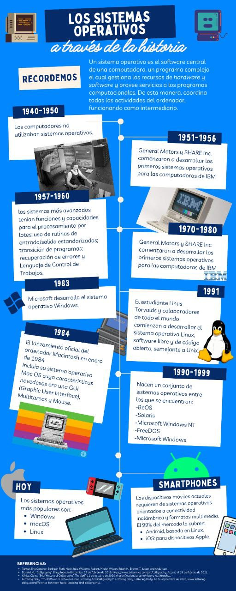

## Arquitectura del Computador T1-T3
  
### Sistemas Operativos
      
      
      
Vamos a conocer un poco sobre los sistemas operativos con los que trabajaremos como lo son Windows y Linux, también conoceremos el proceso de instalación de cada uno de ellos.
****
#### Windows
      
   Windows es un grupo de varias familias de sistemas operativos gráficos patentados desarrollados y comercializados por Microsoft. Cada familia atiende a un determinado sector de la industria informática. Las familias activas de Windows incluyen Windows NT y Windows IoT; estos pueden abarcar subfamilias (por ejemplo, Windows Server o Windows Embedded Compact) (Windows CE). Las familias desaparecidas de Windows incluyen Windows 9x, Windows Mobile y Windows Phone.
    Microsoft introdujo un entorno operativo llamado Windows el 20 de noviembre de 1985, como un shell de sistema operativo gráfico para MS-DOS en respuesta al creciente interés en las interfaces gráficas de usuario. 
    Apple llegó a ver a Windows como una invasión injusta de su innovación en el desarrollo de GUI implementado en productos como Lisa y Macintosh (finalmente resuelto en los tribunales a favor de Microsoft en 1993). En las PC, Windows sigue siendo el sistema operativo más popular en todos los países. Sin embargo, en 2014, Microsoft admitió haber perdido la mayor parte del mercado general de sistemas operativos frente a Android, debido al crecimiento masivo de las ventas de teléfonos inteligentes con Android. En 2014, la cantidad de dispositivos Windows vendidos fue menos del 25% de los dispositivos Android vendidos. Según StatCounter, para computadoras de escritorio y portátiles, Windows tiene aproximadamente el 75% de participación de mercado a partir de abril de 2022.
    En la actualidad, Windows cuenta con una variedad de versiones de sistemas operativos los cuales son muy predominantes en el mercado, entre esos Sistemas Operativos se encuentran: 
    
    - Windows Vista
    - Windows 7
    - Windows 8
    - Windows 10
    - Windows 11
    
****
#### Linux 
    
   Linux es una familia de sistemas operativos de código abierto similares a Unix basados en el kernel de Linux, un kernel de sistema operativo lanzado por primera vez el 17 de septiembre de 1991 por Linus Torvalds. vLinux generalmente se empaqueta en una distribución de Linux. 
    Linux se desarrolló originalmente para computadoras personales basadas en la arquitectura Intel x86, pero desde entonces ha sido portado a más plataformas que cualquier otro sistema operativo. Debido al predominio de Android basado en Linux en los teléfonos inteligentes, Linux, incluido Android, tiene la mayor base de todos los sistemas operativos de propósito general, a partir de mayo de 2022. Aunque Linux, a partir de mayo de 2022, solo lo usa alrededor del 2.3 por ciento de las computadoras de escritorio, el Chromebook, que ejecuta Chrome OS basado en el kernel de Linux, domina los EE. UU. K –12 mercado educativo y representa casi el 20 por ciento de las ventas de portátiles de menos de $300 en los EE. UU. Linux es el sistema operativo líder en servidores (más del 96,4 % de los principales sistemas operativos de 1 millón de servidores web son Linux), lidera otros grandes sistemas de hierro, como las computadoras centrales, y es el único sistema operativo utilizado en las supercomputadoras TOP500 (desde noviembre de 2017, habiendo eliminado gradualmente a todos los competidores).
    Por otro lado, podemos conocer un poco más de el conjunto de versiones más populares de sistemas operativos con los cuales cuenta linux: 
    
    - Ubuntu
    - Linux Mint
    - Debian
    - OpenSUSE
    - Fedora
    - Arch Linux
    - Manjaro 

    
    
    
    
    
    
  
You can use the [editor on GitHub](https://github.com/EdwardJSM23/Arq-Comp-I-UPTM/edit/gh-pages/index.md) to maintain and preview the content for your website in Markdown files.

Whenever you commit to this repository, GitHub Pages will run [Jekyll](https://jekyllrb.com/) to rebuild the pages in your site, from the content in your Markdown files.

### Markdown

Markdown is a lightweight and easy-to-use syntax for styling your writing. It includes conventions for

```markdown
Syntax highlighted code block

# Header 1
## Header 2
### Header 3

- Bulleted
- List

1. Numbered
2. List

**Bold** and _Italic_ and `Code` text

[Link](url) and 
```

For more details see [Basic writing and formatting syntax](https://docs.github.com/en/github/writing-on-github/getting-started-with-writing-and-formatting-on-github/basic-writing-and-formatting-syntax).

### Jekyll Themes

Your Pages site will use the layout and styles from the Jekyll theme you have selected in your [repository settings](https://github.com/EdwardJSM23/Arq-Comp-I-UPTM/settings/pages). The name of this theme is saved in the Jekyll `_config.yml` configuration file.

### Support or Contact

Having trouble with Pages? Check out our [documentation](https://docs.github.com/categories/github-pages-basics/) or [contact support](https://support.github.com/contact) and we’ll help you sort it out.
